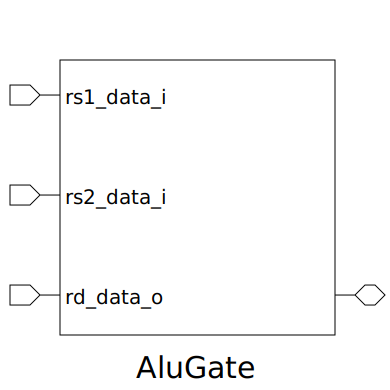

# AluGate (module)

### Author : Mymuna Khatun Sadia (maimuna14400@gmail.com)

## TOP IO

## Description

Write a markdown documentation for this systemverilog module:

## Parameters
|Name|Type|Dimension|Default Value|Description|
|-|-|-|-|-|

## Ports
|Name|Direction|Type|Dimension|Description|
|-|-|-|-|-|
|rs1_data_i|input|logic [DATA_WIDTH-1:0]||source reg 01 data|
|rs2_data_i|input|logic [DATA_WIDTH-1:0]||source reg 02 data|
|func_i|input|func_t||function of and, or, xor, not|
|rd_data_o|output|logic [DATA_WIDTH-1:0]||destination reg data|
