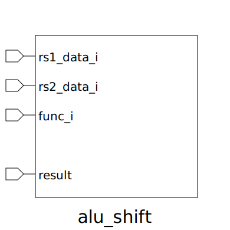

# Alu_Shift (module)

### Author : Bokhtiar Foysol Himon (bokhtiarfoysol@gmail.com)

## TOP IO

## Description

Write a markdown documentation for this systemverilog module:

## Parameters
|Name|Type|Dimension|Default Value|Description|
|-|-|-|-|-|

## Ports
|Name|Direction|Type|Dimension|Description|
|-|-|-|-|-|
|rs1_data_i|input|logic [DATA_WIDTH - 1:0]||input data from Rs1|
|rs2_data_i|input|logic [DATA_WIDTH - 1:0]||input data from Rs2|
|func_i|input|func_t||input func_t from Instruction Decoder|
|result|input|logic [5:0] imm; logic [DATA_WIDTH - 1:0]||output result|
