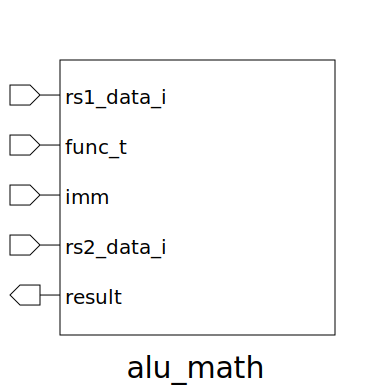

# alu_math (module)

### Author : Anindya Kishore Choudhury (anindyakchoudhury@gmail.com)

## TOP IO

## Description

Write a markdown documentation for this systemverilog module:

## Parameters
|Name|Type|Dimension|Default Value|Description|
|-|-|-|-|-|

## Ports
|Name|Direction|Type|Dimension|Description|
|-|-|-|-|-|
|rs1_data_i|input|logic [DATA_WIDTH-1:0]|||
|func_o|input|logic||confused about instr_t|
|imm|input|logic [5:0]|| confused about instr_t|
|rs2_data_i|input|logic [DATA_WIDTH-1:0]|||
|result|output|logic [DATA_WIDTH-1:0]|||
