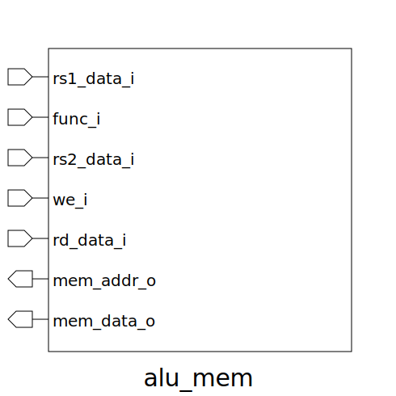

# alu_mem (module)

### Author : Md. Nayem Hasan (nayem90375@gmail.com)

## TOP IO

## Description

Write a markdown documentation for this systemverilog module:

## Parameters
|Name|Type|Dimension|Default Value|Description|
|-|-|-|-|-|

## Ports
|Name|Direction|Type|Dimension|Description|
|-|-|-|-|-|
|rs1_data_i|input|logic [DATA_WIDTH-1:0]||Memory address|
|func_i|input|func_t||Function code to select LOAD or STORE|
|rs2_data_i|input|logic [DATA_WIDTH-1:0]||Data to be stored for STORE operation|
|we_i|input|logic||Write enable input signal|
|mem_data_i|input|logic [DATA_WIDTH-1:0]||Data read from memory for LOAD operation|
|rd_data_o|output|logic [DATA_WIDTH-1:0]||Output from the memory block to the des register|
|result|output|logic [DATA_WIDTH-1:0]||Result (data read from memory for LOAD)|
|mem_addr_o|output|logic [DATA_WIDTH-1:0]||Memory address output (for LOAD/STORE)|
|mem_data_o|output|logic [DATA_WIDTH-1:0]||Data to be written to memory (for STORE)|
