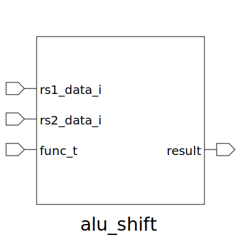

# alu_shift (module)

### Author : Bokhtiar Foysol Himon (bokhtiarfoysol@gmail.com)

## TOP IO

## Description

Write a markdown documentation for this systemverilog module:

## Parameters
|Name|Type|Dimension|Default Value|Description|
|-|-|-|-|-|
|SHIFT_WIDTH|int||5| -PARAMETERS -LOCALPARAMS|

## Ports
|Name|Direction|Type|Dimension|Description|
|-|-|-|-|-|
|rs1_data_i|input|logic [DATA_WIDTH - 1:0 ]||input data from Rs1|
|rs2_data_i|input|logic [DATA_WIDTH - 1:0 ]||input data from Rs2|
|func_t|input|logic [15:0 ]||input func_t from Instruction Decoder|
|result|output|logic [DATA_WIDTH - 1:0 ]||output result|
