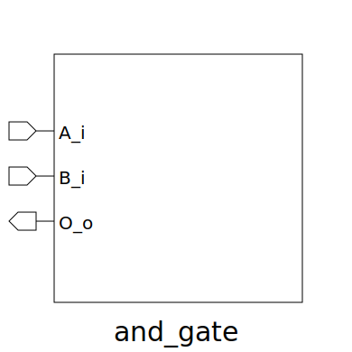

# and_gate (module)

### Author : Bokhtiar Foysol Himon (bokhtiarfoysol@gmail.com)

## TOP IO

## Description

Write a markdown documentation for this systemverilog module:

## Parameters
|Name|Type|Dimension|Default Value|Description|
|-|-|-|-|-|

## Ports
|Name|Direction|Type|Dimension|Description|
|-|-|-|-|-|
|A_i|input|logic|| -PORTS|
|B_i|input|logic|||
|O_o|output|logic|||
