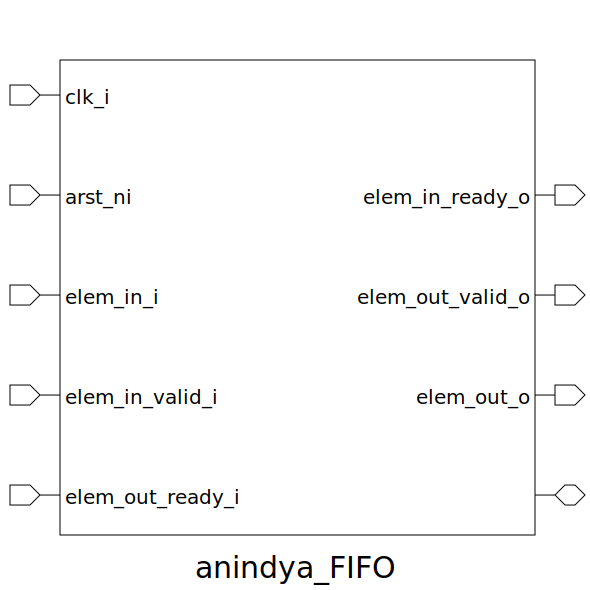

# anindya_FIFO (module)

### Author : Anindya Kishore Choudhury (anindyakchoudhury@gmail.com)

## TOP IO

## Description

Write a markdown documentation for this systemverilog module:

## Parameters
|Name|Type|Dimension|Default Value|Description|
|-|-|-|-|-|
|PIPELINED|bit||1|determines whether the fifo is pipelined or not|
|DATA_WIDTH|int||8| determines whether the fifo is pipelined or not|
|FIFO_SIZE|int||4|means memory depth|

## Ports
|Name|Direction|Type|Dimension|Description|
|-|-|-|-|-|
|clk_i|input|logic||inp clock signal|
|arst_ni|input|logic||async active low reset signal|
|elem_in_i|input|logic [DATA_WIDTH-1:0]|| inp clock signal async active low reset signal input element|
|elem_in_valid_i|input|logic||input valid signal|
|elem_in_ready_o|output|logic||input ready signal to indicate FIFO is ready to accept the value or not|
|elem_out_valid_o|output|logic||input valid signal, indicates whether the input element is valid or not|
|elem_out_ready_i|input|logic||output ready signal, whether FIFO is ready to give the output or not|
|elem_out_o|output|logic [DATA_WIDTH-1:0]||output element|
||interface||||
