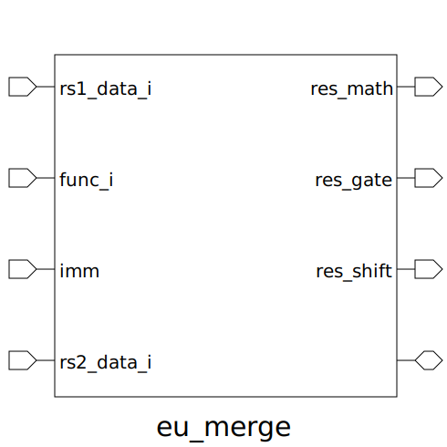

# eu_merge (module)

### Author : Ramisa Tahsin (ramisashreya@gmail.com)

## TOP IO

## Description

Write a markdown documentation for this systemverilog module:

## Parameters
|Name|Type|Dimension|Default Value|Description|
|-|-|-|-|-|

## Ports
|Name|Direction|Type|Dimension|Description|
|-|-|-|-|-|
|rs1_data_i|input|logic [DATA_WIDTH-1:0]||source register 1 data input from RF|
|func_i|input|func_t||funct_i|
|imm|input|logic [5:0]||immediate input|
|rs2_data_i|input|logic [DATA_WIDTH-1:0]||second register value input|
|res_math|output|logic [DATA_WIDTH-1:0]||final result input for add,addi,sub|
|res_gate|output|logic [DATA_WIDTH-1:0]||result for gate operation|
|res_shift|output|logic [DATA_WIDTH-1:0]||result for shift operation|
||interface||||
