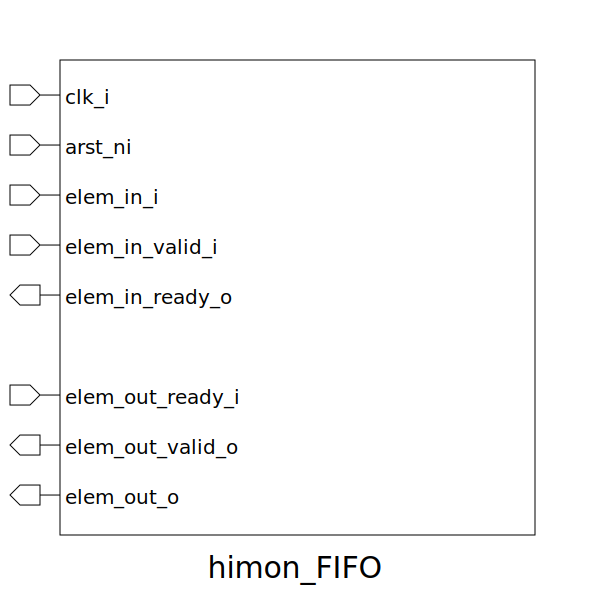

# himon_FIFO (module)

### Author : Bokhtiar Foysol Himon (bokhtiarfoysol@gmail.com)

## TOP IO

## Description

Write a markdown documentation for this systemverilog module:

## Parameters
|Name|Type|Dimension|Default Value|Description|
|-|-|-|-|-|
|Data_Width|int||8| -PARAMETERS -LOCALPARAMS|
|Mem_Depth|int||16||

## Ports
|Name|Direction|Type|Dimension|Description|
|-|-|-|-|-|
|clk_i|input|logic||clk input|
|arst_ni|input|logic||asynchronous reset negedge|
|elem_in_i|input|logic [Data_Width-1:0]||input element|
|elem_in_valid_i|input|logic||indicates if data is valid|
|elem_in_ready_o|output|logic||indicates if data is ready|
|elem_out_ready_i|input|logic|||
|elem_out_valid_o|output|logic|||
|elem_out_o|output|logic [Data_Width-1:0]|||
