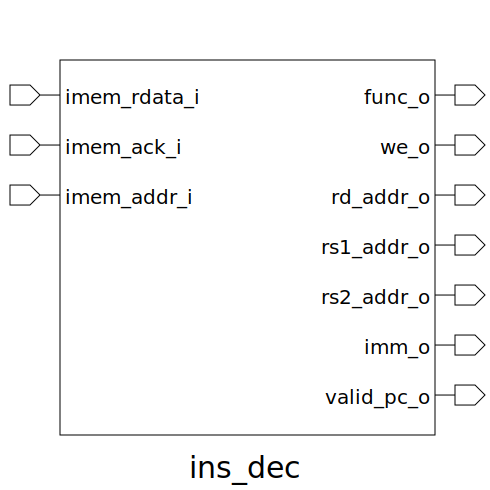

# ins_dec (module)

### Author : Anindya Kishore Choudhury (anindyakchoudhury@gmail.com)

## TOP IO

## Description

This system verilog module performs the functionality of instruction decoder

## Parameters
|Name|Type|Dimension|Default Value|Description|
|-|-|-|-|-|

## Ports
|Name|Direction|Type|Dimension|Description|
|-|-|-|-|-|
|imem_rdata_i|input|logic [INSTR_WIDTH-1:0]||instruction data coming from IMEM|
|imem_ack_i|input|logic||IMEM ack to select between imem_rdata_i or 0|
|imem_addr_i|input|logic [INSTR_WIDTH-1:0]||Address we are fetching from imem_rdata_i|
|func_o|output|func_t||op codes are stored in this typedef|
|we_o|output|logic||write enable pin for RF|
|rd_addr_o|output|logic [2:0]||destination register address|
|rs1_addr_o|output|logic [2:0]||RS1 register address|
|rs2_addr_o|output|logic [2:0]||RS2 register address|
|imm_o|output|logic [5:0]||unextended immediate|
|valid_pc|output|logic||for mux selector input after pc|
