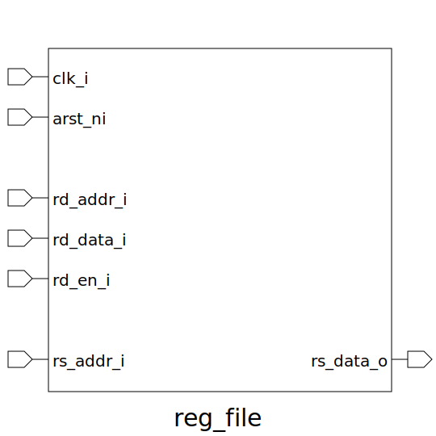

# reg_file (module)

### Author : Anindya Kishore Choudhury (anindyakchoudhury@gmail.com)

## TOP IO

## Description

The `reg_file` module is a register file with a configurable number of source registers, register
width, and an option to hardcode zero to the first register.

## Parameters
|Name|Type|Dimension|Default Value|Description|
|-|-|-|-|-|
|NUM_RS|int||2|number of source register|
|ZERO_REG|bit||1|hardcoded zero(0) to first register|
|NUM_REG|int||8|number of registers|
|REG_WIDTH|int||32|width of each register|

## Ports
|Name|Direction|Type|Dimension|Description|
|-|-|-|-|-|
|clk_i|input|logic||Global clock|
|arst_ni|input|logic||asynchronous active low reset|
|rd_addr_i|input|logic [$clog2(NUM_REG)-1:0]||destination register address|
|rd_data_i|input|logic [ REG_WIDTH-1:0]||read data|
|we_i|input|logic||write enable|
|rs1_addr_i|input|logic [$clog2(NUM_REG)-1:0]||source register 1 address|
|rs2_addr_i|input|logic [$clog2(NUM_REG)-1:0]||source register 2 address|
|rs1_data_o|output|logic [REG_WIDTH-1:0]||source register 1 data|
|rs2_data_o|output|logic [REG_WIDTH-1:0]||source register 2 data|
